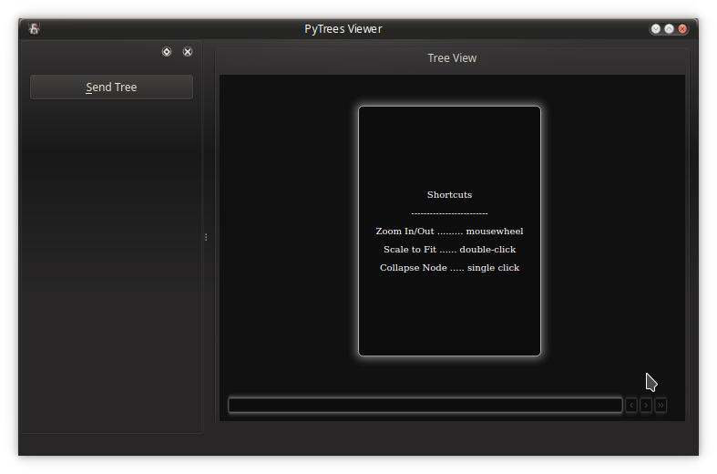
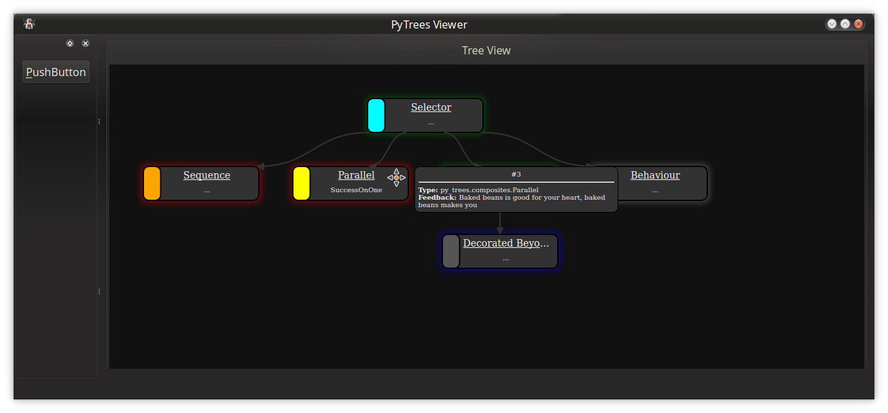

# PyTrees Js

[[About](#about)] [[Features](#features)] [[Preview](#preview)] [[Exmaple - Simple Web App](#example---simple-web-app)] [[Example - PyQt App](#example---pyqt-app)] [[The JSON Specification](#the-json-specification)]

## About

Libraries for visualisation of runtime or replayed behaviour trees.

* [./js](./js) - a self-contained javascript library to build apps around
* [py_trees_js](./py_trees_js) - a python package that makes the js available as a pyqt resource
* [py_trees_js.viewer](./py_trees_js/viewer) - a demo pyqtwebengine app

See [py_trees_ros_viewer](https://github.com/splintered-reality/py_trees_ros_viewer) for a fully fledged pyqt integration that uses [py_trees_js](./py_trees_js).

## Features

* Visualise the runtime state of a behaviour tree
* Collapsible subtrees
* Zoom and scale contents to fit
* Timeline rewind & resume
* Blackboard key-value storage view
* Activity log view

Although designed for py_trees, the js libs (in particular, the interfaces) are not dependent on py_trees and could be used for other behaviour tree applications.

## Preview

```
$ git clone https://github.com/splintered-reality/py_trees_js
$ code .
# Reopen the project in the devcontainer
$ poetry install
$ poetry shell
$ py-trees-demo-viewer
```
<p align="center">
  
  
</p>

## Example - Simple Web App

Building a complete application that can render a behaviour tree stream is an effort that can be decomposed into two tasks:

1. Creating the web app for rendering trees and visualising a timeline
2. Wrapping the web app in a framework and connecting it to an external stream

The first stage is purely an exercise with html, css and javascript. The latter will depend on your use case - it could be a qt-js hybrid application (as exemplified here) for developers, an electron application for cross-platform and mobile deployment or a cloud based service.

This section will walk through how to build a web application with the provided js libraries. An example of wrapping the web app within a Qt-Js application will follow.

To get started, let's begin with a basic html page with two divs, one for the tree canvas and one for the timeline:

```xhtml
<!doctype html>
<html>
<head>
  <meta charset="utf-8">
  <title>PyTrees Viewer</title>
  <style>
    html {
      height: 100%  /* canvas is intended to fill the screen, cascading heights achieves this */
    }
    body {
      margin: 0;
      overflow:hidden;  /* no scrollbars */
      height: 100%  /* canvas is intended to fill the screen, cascading heights achieves this */
    }
  </style>
</head>
<body>
  <div id="canvas"></div>
  <div id="timeline"></div>
</body>
</html>
```

Next, bring in the javascript libraries. For exemplar purposes, it is assumed here that the libraries
have been made available alongside the html page - how is an integration detail depending on the mode
of deployment (see next section for an example).

Note that the `py_trees-<version>.js` library has only one dependency, [jointjs](https://resources.jointjs.com/docs/jointjs/v3.0/joint.html),
but that in turn has a few dependencies of it's own. The bundled libraries in the `js/jointjs` folder
of this repository correspond to the requirements for a specific version of jointjs and
have been tested to work with the accompany `py_trees-<version>.js` library.

You can verify that the libraries have been properly imported by calling `py_trees.hello()` which
will print version information of the loaded javascript libraries (if found) to the javascript console.

```xhtml
<!doctype html>
<html>
<head>
  <meta charset="utf-8">
  <title>PyTrees Viewer</title>
  <link rel="stylesheet" href="js/py_trees-0.6.0.css"/>
  <link rel="stylesheet" type="text/css" href="js/jointjs/joint-3.0.4.min.css"/>
  <script src="js/jointjs/dagre-0.8.4.min.js"></script>
  <script src="js/jointjs/graphlib-2.1.7.min.js"></script>
  <script src="js/jointjs/jquery-3.4.1.min.js"></script>
  <script src="js/jointjs/lodash-4.17.11.min.js"></script>
  <script src="js/jointjs/backbone-1.4.0.js"></script>
  <script src="js/jointjs/joint-3.0.4.min.js"></script>
  <script src="js/py_trees-0.6.0.js"></script>
  <!-- Web app integration css here -->
  <style>
    html {
      height: 100%  /* canvas is intended to fill the screen, cascading heights achieves this */
    }
    body {
      margin: 0;
      overflow:hidden;  /* no scrollbars */
      height: 100%  /* canvas is intended to fill the screen, cascading heights achieves this */
    }
  </style>
</head>
<body>
  <script type="text/javascript">
    py_trees.hello()
  </script>
  <div id="window">
    <div id="canvas"></div>
    <div id="timeline"></div>
  </div>
</body>
</html>
```

Output from `py_trees.hello()`:

```
********************************************************************************
                               Py Trees JS

 A javascript library for visualisation of executing behaviour trees.

 Version & Dependency Info:
  - py_trees:  0.6.0
    - jointjs :  3.1.0
       - backbone:  1.4.0
       - dagre   :  0.8.4
       - jquery  :  3.4.1
       - lodash  :  4.17.11
********************************************************************************
```

In the next iteration, the canvas is initialised and a callback for
accepting incoming trees from an external source is prepared. To test it,
pass it the demo tree provided by the library.

```xhtml
<!doctype html>
<html>
<head>
  <meta charset="utf-8">
  <title>PyTrees Viewer</title>
  <link rel="stylesheet" href="js/py_trees-0.6.0.css"/>
  <link rel="stylesheet" type="text/css" href="js/jointjs/joint-3.0.4.min.css"/>
  <script src="js/jointjs/dagre-0.8.4.min.js"></script>
  <script src="js/jointjs/graphlib-2.1.7.min.js"></script>
  <script src="js/jointjs/jquery-3.4.1.min.js"></script>
  <script src="js/jointjs/lodash-4.17.11.min.js"></script>
  <script src="js/jointjs/backbone-1.4.0.js"></script>
  <script src="js/jointjs/joint-3.0.4.min.js"></script>
  <script src="js/py_trees-0.6.0.js"></script>
  <!-- Web app integration css here -->
  <style>
    html {
      height: 100%  /* canvas is intended to fill the screen, cascading heights achieves this */
    }
    body {
      margin: 0;
      overflow:hidden;  /* no scrollbars */
      height: 100%  /* canvas is intended to fill the screen, cascading heights achieves this */
    }
  </style>
</head>
<body>
  <script type="text/javascript">
    py_trees.hello()
  </script>
  <div id="window">
    <div id="canvas"></div>
    <div id="timeline"></div>
  </div>
  <script type="text/javascript">
    // rendering canvas
    canvas_graph = py_trees.canvas.create_graph()
    canvas_paper = py_trees.canvas.create_paper({graph: canvas_graph})

    render_tree = function({tree}) {
      py_trees.canvas.update_graph({graph: canvas_graph, tree: tree})
      py_trees.canvas.layout_graph({graph: canvas_graph})
      if ( canvas_graph.get('scale_content_to_fit') ) {
        py_trees.canvas.scale_content_to_fit(canvas_paper)
      }
      return "rendered"
    }
    render_tree({tree: py_trees.experimental.create_demo_tree_definition()})
  </script>
</body>
</html>
```

At this point, your web app should be visualising a single tree and
zoom/collapse/scale to fit interactions functional. I'm happy, you should be too!

Adding a timeline to the application is optional, but the code does not
change significantly and is a very useful feature to have. The built-in demo
app's [index.html](py_trees_js/viewer/html/index.html) does exactly this. The code is reproduced below for convenience.

```xhtml
<!doctype html>
<html>
<head>
  <meta charset="utf-8">
  <title>PyTrees Viewer</title>
  <link rel="stylesheet" href="js/py_trees-0.6.0.css"/>
  <link rel="stylesheet" type="text/css" href="js/jointjs/joint-3.0.4.min.css"/>
  <script src="js/jointjs/dagre-0.8.4.min.js"></script>
  <script src="js/jointjs/graphlib-2.1.7.min.js"></script>
  <script src="js/jointjs/jquery-3.4.1.min.js"></script>
  <script src="js/jointjs/lodash-4.17.11.min.js"></script>
  <script src="js/jointjs/backbone-1.4.0.js"></script>
  <script src="js/jointjs/joint-3.0.4.min.js"></script>
  <script src="js/py_trees-0.6.0.js"></script>
  <!-- Web app integration css here -->
  <style>
    html {
      height: 100%  /* canvas is intended to fill the screen, cascading heights achieves this */
    }
    body {
      margin: 0;
      overflow:hidden;  /* no scrollbars */
      height: 100%  /* canvas is intended to fill the screen, cascading heights achieves this */
    }
  </style>
</head>
<body>
  <script type="text/javascript">
    py_trees.hello()
  </script>
  <div id="window">
    <div id="canvas"></div>
    <div id="timeline"></div>
  </div>
  <script type="text/javascript">
    // rendering canvas
    canvas_graph = py_trees.canvas.create_graph()
    canvas_paper = py_trees.canvas.create_paper({graph: canvas_graph})

    // event timeline
    timeline_graph = py_trees.timeline.create_graph({event_cache_limit: 100});
    timeline_paper = py_trees.timeline.create_paper({
        timeline_graph: timeline_graph,
        canvas_graph: canvas_graph,
        canvas_paper: canvas_paper,
    })

    // react to window resizing events
    $(window).resize(function() {
      py_trees.canvas.on_window_resize(canvas_paper)
      py_trees.timeline.on_window_resize(timeline_paper)
    })

    render_tree = function({tree}) {
      py_trees.timeline.add_tree_to_cache({
          timeline_graph: timeline_graph,
          canvas_graph: canvas_graph,
          canvas_paper: canvas_paper,
          tree: tree
      })
      return "rendered"
    }
  </script>
</body>
</html>
```

## Example - PyQt App

The `py-trees-demo-viewer` app is a qt-js hybrid application using `qtwebengine`.
Every time a qt button is pressed, an internally generated tree snapshot is sent to `render_tree()` in the embedded web application. From here, it is not too hard to
imagine connecting the qt application to an actual external source. The qt layer
then acts as a shim or relay transferring messages to the internal web app.

How does it work? 

* The js libs are made available as a `.qrc` resource [1]
* A simple web app is made available as another `.qrc` resource
* Both resources are consumed by the QWebEngine View to serve the app

[1] This can be made available separately and as a dependency to the actual
pyqt application. For instance, the [py_trees_js](./py_trees_js) package is a dependency of [py_trees_ros_viewer](https://github.com/splintered-reality/py_trees_ros_viewer).

In more detail...

### The JS Libraries

1. Bundle the javascript resources into a `.qrc` file
2. Generate the resources as a c++ library / python module
3. Deploy the c++ library/python module in your development environment

In this case, the py_trees and jointjs javascript libraries have been listed
in [py_trees_js/resources.qrc](py_trees_js/resources.qrc), generated using
[py_trees_js/gen.bash](py_trees_js/gen.bash), resulting in the importable module
[py_trees_js/resources.py](py_trees_js/resources.py). From this point, any pythonic
Qt application wishing to visualise behaviour trees need only import this module from the `py_trees_js` package.

### The Web App

1. Bundle the `.html`/`.css` pages into a `.qrc` file
2. Import into directly into designer when building your Qt application

In this case, our web app ([py_trees_js/viewer/html/index.html](py_trees_js/viewer/html/index.html)) has been rolled into [py_trees_js/viewer/web_app.qrc](py_trees_js/viewer/web_app.qrc) which is directly loaded into [py_trees_js/viewer/web_view.ui](py_trees_js/viewer/web_view.ui) where the URL property of the QWebEngineView widget has been configured with the resources `index.html`.

You could alternatively, generate a module from the `.qrc` and import that into the
relevant python code as was done for the javascript resources.

### The Qt Application

The Qt application can be designed in whatever way you're most comfortable with - via
Designer, pure C++ or python. In this case, Qt's Designer is used to produce the `.ui`
files which are generated into python modules and finally customised and brought together
as a PyQt5 application. Refer to [py_trees_js/viewer](py_trees_js/viewer) for more details
or as a reference example from which to start your own Qt-Js hybrid application.

Key elements:

1. Build your Qt application around a QWebEngineView widget
2. Link/import the javascript module in the web engine view class
3. Load the html page into the QWebEngineView view

Do not use the QWebView widget - this is deprecating in favour of the QWebEngineView widget. The most notable difference is that QWebView uses Qt's old webkit, while QWebEngineView makes use of Chromium's webkit.

Note that the second step automagically makes available the javascript resources to the application
when it's loaded. It's not terribly fussy about where it gets loaded, see [py_trees_js/viewer/web_view.py](py_trees_js/viewer/web_view.py) for an example:

```
# This is the module generated by running pyrcc5 on the js libraries .qrc
# It could have been equivalently deployed in a completely different python package
import py_trees_js.resources
```

Loading the web page can be accomplished in designer. Simply point it at your qresource file
and set the dynamic URL property on the QWebEngineView widget. Alternatively you can import
the resource module and load it via QWebEngineView's `load` api.

#### Qt-Js Interactions

Qt and JS can interact directly over snippets of javascript code (via `runJavaScript()`
or over QWebChannel (a mechanism similar to sigslots) where more complexity is needed.
The example application here calls on the `render_tree()` method we created earlier in
the web application to send trees to the app. Example code from [py_trees_js/viewer/viewer.py](py_trees_js/viewer/viewer.py) which handles button clicks to cycle through a list of
demonstration trees:

```
def send_tree_response(reply):
    console.logdebug("reply: '{}' [viewer]".format(reply))


@qt_core.pyqtSlot()
def send_tree(web_view_page, demo_trees, unused_checked):
    demo_trees[send_tree.index]['timestamp'] = time.time()
    console.logdebug("send: tree '{}' [{}][viewer]".format(
        send_tree.index, demo_trees[send_tree.index]['timestamp'])
    )
    javascript_command = "render_tree({{tree: {}}})".format(demo_trees[send_tree.index])
    web_view_page.runJavaScript(javascript_command, send_tree_response)
    send_tree.index = 0 if send_tree.index == 2 else send_tree.index + 1

send_tree.index = 0
```

## The JSON Specification

TODO: A JSon schema

Roughly, the specification expects json objects of the form:

* timestamp: int
* behaviours: dict[str, dict]
* (optional) visited_path: list[str]
* (optional) blackboard: {
*    behaviours: dict[str, dict[str, str]],
*    data: dict[str, str]
* }
* (optional) activity: list[str]

where each behaviour in the dict has specification:

* id: str
* status: Union[`INVALID`,`FAILURE`, `RUNNING`, `SUCCESS`]
* name: str
* colour: <html style hex code>
* (optional) children: List[str]
* (optional) data: <generic key-value dictionary>

Identification strings (id's) must be unique and are used as both keys for the
behaviours dictionary, children and visited_path variables.

An example (extracted from `py_trees.experimental.create_demo_tree_definition()`):

```
{
    timestamp: 1563938995,
    visited_path: ['1', '2', '3', '4', '5', '7', '8'],
    behaviours: {
        '1': {
            id: '1',
            status: 'RUNNING',
            name: 'Selector',
            colour: '#00FFFF',
            children: ['2', '3', '4', '6'],
            data: {
                Type: 'py_trees.composites.Selector',
                Feedback: "Decision maker",
            },
        },
        '2': {
            id: '2',
            status: 'FAILURE',
            name: 'Worker',
            colour: '#FFA500',
            children: ['7', '8', '9'],
            data: {
                Type: 'py_trees.composites.Sequence',
                Feedback: "Worker"
            },
        },
    }
    'blackboard': {
        'behaviours': {  # key metadata per behaviour
            '2': {
                '/parameters/initial_value': 'r',
                '/state/worker': 'w'
            },
        },
        'data': {
            '/parameters/initial_value': 'foo',
            '/state/worker': 'bar',
        },
    'activity': [
        "<text style='color: blue;'>Worker initialised with 'foo'</text>'",
        "<text style='color: red;'>Worker wrote 'bar'</text>'",
    ]
}
